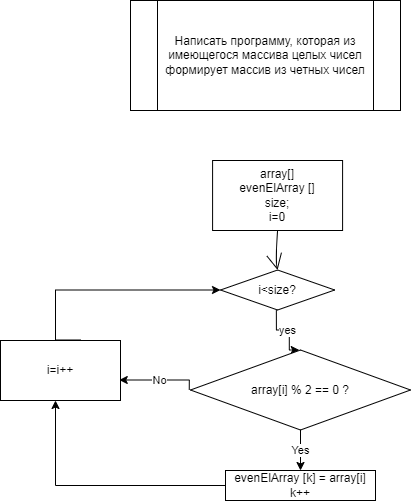

# Итоговая проверочная работа.

## Оглавление
+ Основная идея
+ План решения
+ Описание методов
    + Общие методы
    + Методы для решения поставленной задачи
+ Блок-схема основного метода (int[] GetEvenElementsArray)

## Основная идея

> Написать программу, которая из имеющегося массива целых чисел формирует массив из четных чисел

План решения:
* Общие методы;
    > Можно использовать в дальнейшем для других задач;
* Решение поставленной задачи;
    > Специфичное наименование, чтобы было понятно, что делает конкретно;
* Исполнение программы;
    > Рюшечки

## Описание методов
### Общие методы
```
int GetArray - создание одномерного массива из рандомных чисел;
```
* Inputs: 
    > int size;

    > int leftBound;

    > int rightBound;

* Return:
    > array [];
```
void PrintArray - печать одномерного массива;
```
* Inputs: 
    > int [] arrayForPrint


### Методы для решения поставленной задачи
```
int CountOfEvenNumbers - определение количества четных элементов одномерного массива, которое необходимо для создания нового массива из четных элементов;
```
* Inputs:
    > int[] array
* Return:
    > count;
```
int[] GetEvenElementsArray - создание массива только с четныими элементами;
```
* Inputs:
    > int[] arrayForEvenElementsSearch;

    > int count;

* Return:
    > arrayWithEvenElementsOnly;

```
__________________________________________________
```
## Блок-схема
### int[] GetEvenElementsArray




```
__________________________________________________
```